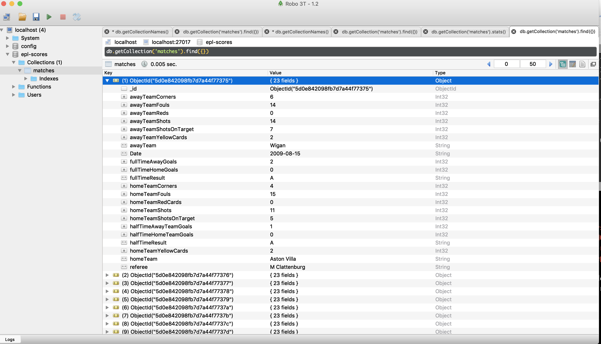

# EPL-DATA-TO-DB

## Purpose
Although there are many relational and non relational DBs to choose 
from I have choosen to store the data in a mongodb. If I were to
choose a relational DB my preference would be postgres.

### Interface

The Data is presented to this module as an Array of 
**MatchResult** objects. The data is retrieved from the **epl-data-reader**
package where it is stored in **json** files covering the premier league 
game results from 2009 to 2019.

This module takes the **MatchResult** data and places it into a mongo DB in
the following format the **matches** collection.

```markdown
interface MatchData {
  awayTeamCorners: number;
  awayTeamFouls: number;
  awayTeamReds: number;
  awayTeamShots: number;
  awayTeamShotsOnTarget: number;
  awayTeamYellowCards: number;
  AwayTeam: string;
  Date: string;
  fullTimeAwayGoals: number;
  fullTimeHomeGoals: number;
  fullTimeResult: string;
  homeTeamCorners: number;
  homeTeamFouls: number;
  homeTeamRedCards: number;
  homeTeamShots: number;
  homeTeamShotsOnTarget: number;
  halfTimeAwayTeamGoals: number;
  halfTimeHomeTeamGoals: number;
  halfTimeResult: string;
  homeTeamYellowCards: number;
  homeTeam: string;
  referee: string;
}
```

If you were to view the data in the mongoDB via **Robo 3T** you would see


